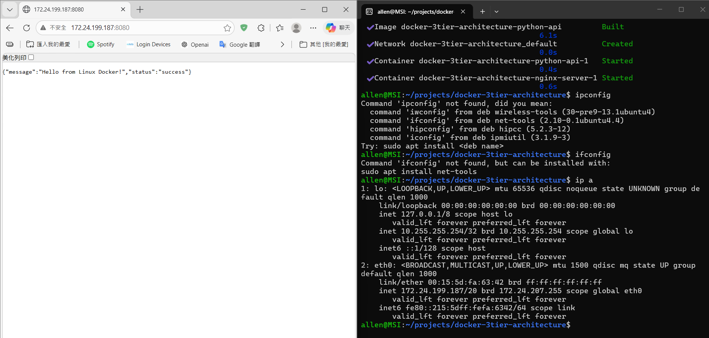
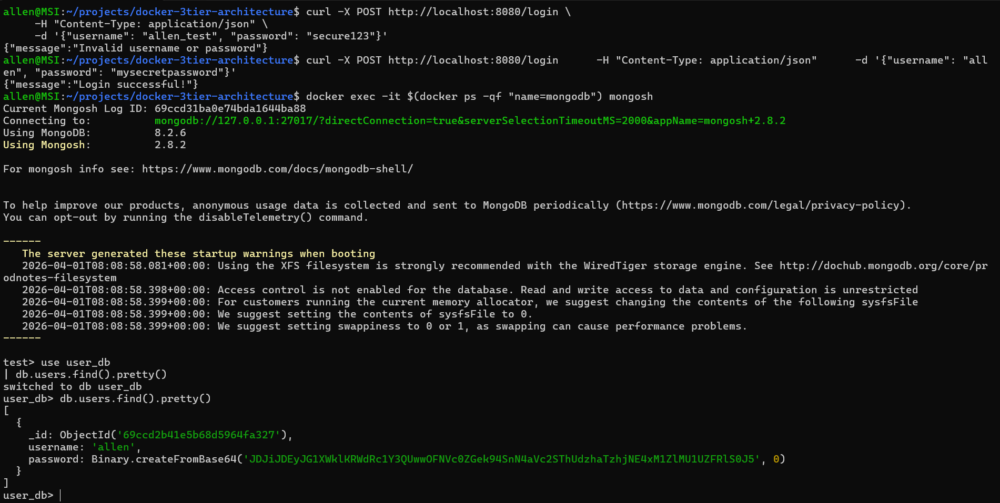

# Docker-based 3-Tier Web Architecture with Auth

這是一個基於 Linux 環境建置的自動化 Web 架構練習專案。主要展示如何整合 **Nginx 反向代理**、**Flask 後端 API** 以及 **MongoDB 資料庫**，並實現容器化部署與資料持久化。

## 🚀 系統架構 (System Architecture)

本專案採用典型的三層式架構：
1. **Nginx (Entry Layer)**: 監聽 Port 8080，負責請求轉發與安全性隔離。
2. **Flask API (Logic Layer)**: 處理使用者註冊與登入邏輯。
3. **MongoDB (Data Layer)**: 儲存使用者資料，並透過 Docker Volume 實現硬碟持久化。

## 🛠️ 技術重點 (Key Features)

* **容器化 (Containerization)**: 使用 Docker Compose 一鍵部署完整開發環境。
* **反向代理 (Reverse Proxy)**: Nginx 設定 `proxy_pass` 隱藏後端真實位址，提升安全性。
* **資安實踐 (Security)**: 使用 `bcrypt` 對密碼進行 **Salted Hashing** 儲存，拒絕明文存儲。
* **映像檔優化**: 選用 `python:3.9-slim` 縮減 Image 體積並減少攻擊面。
* **資料持久化 (Persistence)**: 設定 Docker Volume 確保資料庫不會因容器毀損而遺失資料。

## 📸 運行截圖 (Quick Start Demo)

### 1. 服務啟動狀態

*圖說：所有服務 (Nginx, Python API, MongoDB) 皆正常運作中。*

### 2. API 功能測試 (Registration)

*圖說：透過 cURL 測試註冊功能，成功回傳 JSON 訊息。*
